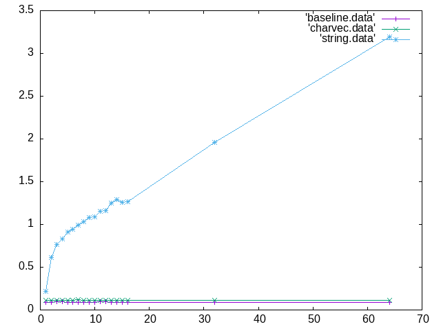
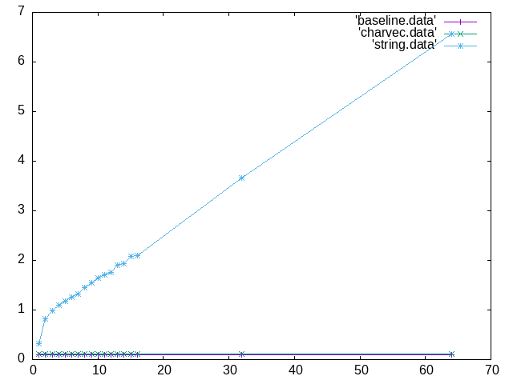

#charvec: Benchmark character sequence random access
Bart Massey 2022

In a Reddit
[comment](https://www.reddit.com/r/learnrust/comments/rwxr1z/what_is_the_difference_between_char_and_string/hrfftn9/)
user /u/pingveno proposed that accessing random characters
of a UTF-8 string in Rust by iteration might be faster than
accessing random elements of a `Vec<char>` even for small
char sequences.

This weak microbenchmark tests this hypothesis. The
benchmark is run separately over sequences of 7-bit ASCII
characters and sequences of arbitrary Unicode code points.
For each sequence type, a random sequence of length *m* is
generated, then indexed 100,000,000 times at random
positions in three ways: not at all ("baseline" condition),
by indexing into a UTF-8 String ("string" condition), and
by indexing into an array of Unicode `char`.

Care is taken to make the printed output a function of the
input so that nothing is optimized out.  Results are for my
Debian Bullseye Linux box with a Ryzen 9 3900X processor.

Just a single representative run is shown.  Changing PRNG
seed and repeated runs gave identical results.  Even
changing PRNG gave comparable results.

*Time for 100,000,000 random accesses of* m *random ASCII characters.*

*Time for 100,000,000 random accesses of* m *random Unicode code points.*

As expected `Vec<char>` dominates `String` at longer
sequence lengths. Slightly more surprisingly, it is not
faster at any length.

## Build And Run

* `cargo build --release`
* `sh bench.sh >bench.txt` (this will take a while)
* `sh graphs.sh`

## License

This work is available under the "MIT License". Please see
the file `LICENSE.txt` in this distribution for license
terms.
